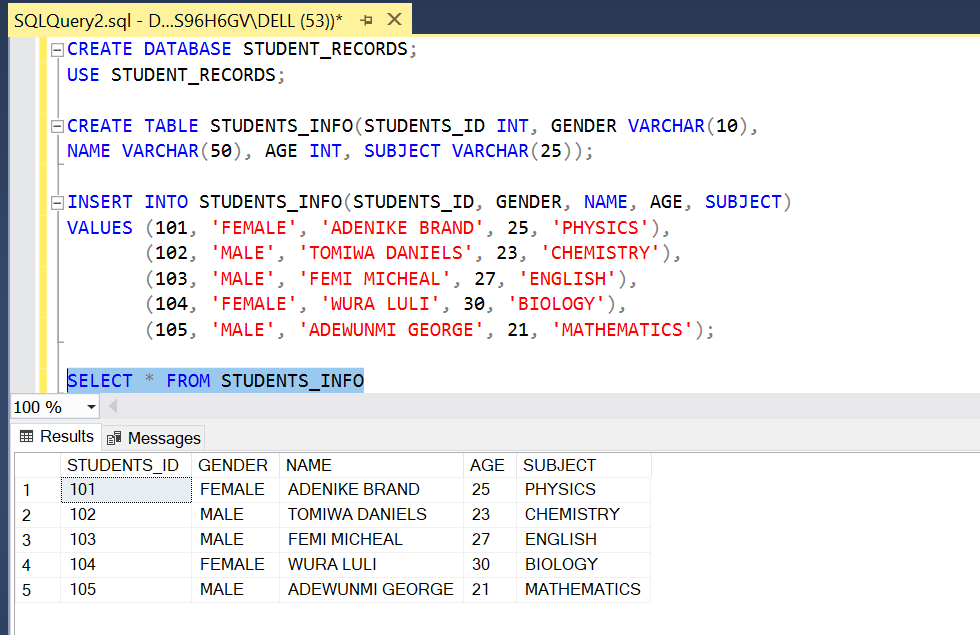

# SQL TASK ONE

## INTRODUCTION

In this task given to me, i'll be creating a database in SQL, using SQL Microsoft Management Studio.
To create, drop and alter tables in the database, apply some modifications, 
constraint, sharing syntax and taking screenshots of results of those syntax from 
questions asked. i'll also upload a file on SQL server. I used some aggregate 
functions such as Max,Count and also syntax such as SELECT, CREATE, DROP, ORDER BY, e.t.c.

 ## PROBLEM STATEMENT
 
Create a Database named “Students Record”
Create the following tables in the database create;
- Students Info  (Student ID, Gender, Name, Age, Subject)
- Health record (Student ID, Blood Group, Height, Weight)
- Performance (Student ID, Score, Grade)

1. The ID has to be unique
2. Where a student has no score, it should be ‘0’ by default
3. Add a constraint that prevents the ID and Subject from taking null values
4. Apply the following modifications to the table
5. Change column name ‘’Subject” to ‘’Course” 
6. Drop the “Age” column from the ‘Students Info’ table.

## SKILLS DEMONSTRATED   

The following were incoporated-
- SELECT, UPDATE, CREATE DATABASE, INSERT INTO.
- ALTER, CREATE TABLE.
- CONSTRAINTS USED; UNIQUE, PRIMARY KEY, NOT NULL.

## SOLUTION

I Created a Database named “STUDENT_RECORDS” using the syntax "CREATE DATABASE STUDENT_RECORDS"
and then proceeded to Create the following tables " STUDENTS_INFO, HEALTH_RECORD 
and PERFORMANCE" in the STUDENT_RECORDS database created. The screenshoot displays 
the database and tables created.

---

### 1. STUDENT INFO TABLE WITH SYNTAX.

I created a table using the CREATE statement to design the 'Student_info' table
and then used INSERT INTO statement to input data into the table, all values
represents a fictional student information of a fictional school.
The following screenshots displays both the SQL syntax and Table created:

---

### 2. HEALTH RECORD TABLE WITH SYNTAX.

The same process from above was incoporated and applied effectively into creating 
a 'Health_record' table and fictional values were inserted using the INSERT INTO.
The following screenshots displays both the SQL syntax and Table created:

---

### 3. PERFORMANCE TABLE WITH SYNTAX.

With the same process as above i also created a 'Performance' table using fictional
students values,The following screenshots displays both the SQL syntax and Table created:

---

### 4. The ID has to be unique.

To impose the 'Student_id" to be unique to make sure every student has a special identity,
the following steps was taken displayed in the syntax screenshot.

---

### 5. Where a student has no score, it should be ‘0’ by default.

To impose that a student has a default score of '0' if no score was recorded, in this task i
applied a constraint to impose the default value.the following steps was taken displayed in the syntax screenshot.

---

### 6. Add a constraint that prevents the ID and Subject from taking null values.

This was a tedios task to do, the following steps was taken displayed in the syntax screenshot.

---

### 7. Apply the following modifications to the table.

- Change column name ‘’Subject” to ‘’Course” 
- Drop the “Age” column from the ‘Students Info’ table.

This last question was the highlight for me, i enjoyed solving this aspect as i didnt get to 
do much, i solved it by using the design method to change column and drop the age column.
The result is displayed in the screenshot. 

SUBJECT TO COURSE      |    AGE DROPPED
:---------------------:|:---------------------:
  |  
---

# CONCLUSION

I now fully understand how to create Database, create Tables, inserting values
add constraints, how to retrieve data from database, how to use aggregate functions.
i really hope you enjoy this little case study, it was fun to create.

**_THE END_**

